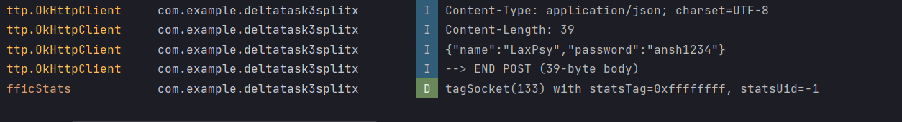

# DeltaTask3SplitX
### Tech-Stack
- Kotlin (Jetpack Compose)
- JavaScript(Express)
- mySQL

- `NodeMon` was used to accelerate the development process of the REST API. 
`Retrofit` was used on Android to facilitate HTTP requests. `bCrypt` was used for cryotography.

Was tested on Android OnePlus Nord CE using port-forwarding via Google Chrome and USB Debugging over WiFi. 

### Demonstration-Video
https://drive.google.com/file/d/1-Nznk1tZDkX7EvmGEFYzcpABUCniT93S/view?usp=drive_link

The glowing/animated border in the History section identifies the person who initated the Split.

### `SocketTimeoutException` Issue
- `SocketTimeoutException` might occurs sometimes when sending a request. An overall app crash has been prevented at each location with the use of a try-catch block. Is circumvented almost everytime by restarting the server. 
- I investigated the HTTP requests sent from Retrofit by using an `OkHTTP3` interceptor, each request is indeed sent but a lot of the times the request isn't received by the server (I have `console.log()` statements set when a request is processed). 
 Replicating the same requests through Postman3 does not yield the same result, the server receives the requests everytime and gives the correct response instantaneously, implying that the port-forwarding setup must be the cause of the issue :(
